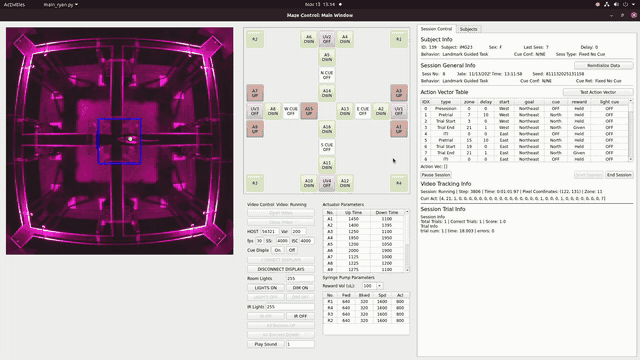

# Maze Control

**A distributed control system for a plus-maze-in-square-track apparatus, built with Ubuntu + Raspberry Pi + Arduino for automated spatial navigation experiments in rodents.**

## Demo

<p align="center">
  
</p>

<p align="center"><em>A rodent subject navigating the maze during a two-start, two-choice (2S2C) task session. The GUI shows real-time position tracking (green dot overlay on the video panel), barrier states, and session progress.</em></p>

---

## About

This repository contains the complete control software for a custom behavioral apparatus consisting of a **plus maze embedded within a 2 × 2 m square track** (González et al.), designed for studying the contributions of path integration and visual landmarks to flexible spatial navigation in rodents.

The apparatus supports a **two-start, two-choice (2S2C)** task in which rats navigate from one of two start arms through the central plus maze to one of two diagonally opposite reward corners on the surrounding square track. Sixteen motorized barriers partition the maze into segments and control which routes are available on each trial. Four computer monitors positioned at the maze corners display visual landmark cues, and four syringe pumps deliver liquid reward (sweetened condensed milk) at the corner wells. White noise (50 Hz–20 kHz) provides acoustic isolation during sessions.

Between sessions, the physical track segments and intersection pieces are **shuffled** according to a randomization script (`SegmentShuffle.py`) to eliminate the use of local odor or textural cues for navigation.

The system coordinates all hardware across three computing platforms — an Ubuntu workstation, Raspberry Pis, and a network of Arduino microcontrollers — communicating over **ZeroMQ** and **Modbus RTU**, orchestrated through a PyQt5-based GUI that enables fully automated or manual experimental sessions.

## System Architecture

```
┌─────────────────────────────────────────────────────────────────────┐
│                     Ubuntu Workstation (Host)                       │
│                                                                     │
│  ┌──────────────┐  ┌──────────────────┐  ┌───────────────────────┐ │
│  │  main_ryan.py │  │ MazeControl_ZMQ  │  │   MazeControl.db      │ │
│  │  (PyQt5 GUI)  │──│ (Device Drivers) │  │   (SQLite Database)   │ │
│  └──────┬───────┘  └────────┬─────────┘  └───────────────────────┘ │
│         │                   │                                       │
│         │ ZeroMQ            │ Modbus RTU (USB-Serial)               │
│         │ (TCP)             │                                       │
└─────────┼───────────────────┼───────────────────────────────────────┘
          │                   │
          ▼                   ▼
┌──────────────────┐  ┌─────────────────────────────────────────────┐
│   Raspberry Pi   │  │            Arduino Network (Modbus)         │
│   (Camera +      │  │                                             │
│    Displays)     │  │  ┌────────────┐ ┌──────────────┐            │
│                  │  │  │ Actuator   │ │ Syringe Pump │ x4         │
│ ┌──────────────┐ │  │  │ Controllers│ │ Controllers  │            │
│ │MotionTrack   │ │  │  │ x16        │ └──────────────┘            │
│ │(picam2 +     │ │  │  └────────────┘                             │
│ │ OpenCV)      │ │  │  ┌────────────┐ ┌──────────────┐            │
│ └──────────────┘ │  │  │ Light      │ │ Cue Light    │ x4         │
│ ┌──────────────┐ │  │  │ Controller │ │ Controllers  │            │
│ │StimulusDisp  │ │  │  └────────────┘ └──────────────┘            │
│ │A & B (pygame)│ │  │                                             │
│ └──────────────┘ │  └─────────────────────────────────────────────┘
└──────────────────┘
```

## Repository Structure

```
maze-control/
├── Ubuntu/
│   ├── main_ryan.py                 # Main PyQt5 GUI application
│   ├── main_2c2s.py                 # GUI variant for 2c2s experiment design
│   ├── MazeControl_ZMQ.py           # Device driver classes (Modbus + ZMQ)
│   ├── MazeControl.db               # SQLite database (subjects, sessions, trials)
│   ├── actuator_parameters.json     # Per-actuator PWM and timing calibration
│   └── syringe_pump_parameters_milk_30ml.json  # Reward volume/speed calibration
│
├── Raspberry-Pi/
│   ├── MotionTrack_ZeroMQ_picam2.py       # Camera + motion tracking (auto white balance)
│   ├── MotionTrack_ZeroMQ_picam2_mwb.py   # Camera + motion tracking (manual white balance)
│   ├── StimulusDisplayRaspiZeroMQ_A.py    # Visual stimulus display (screen pair A)
│   └── StimulusDisplayRaspiZeroMQ_B.py    # Visual stimulus display (screen pair B)
│
├── Arduino/
│   ├── ActuatorControl_Modbus_Maze.ino              # Barrier actuator firmware
│   ├── SyringePumpControl_stepback_Toshiba_Modbus_Maze.ino  # Syringe pump firmware
│   └── Modbus_12V_PWM_Light_Control_Maze.ino        # Room/IR light PWM firmware
│
├── docs/
│   ├── Barrier_Maze_240sq_Coordinate_Map.xlsx  # Zone & barrier pixel coordinates
│   └── Corner_Maze_Procedure.xlsx              # Experimental procedure & checklists
│
├── media/                            # Screenshots and demo media
│   ├── gui_screenshot.png
│   └── demo_gui.gif
│
├── LICENSE
└── README.md
```

## Components

### Ubuntu — Main GUI (`main_ryan.py`)

The host application is a **PyQt5** GUI titled *"Maze Control: Main Window"* with three main panels:

- **Video Panel** — Displays a live overhead camera feed from the Raspberry Pi. The video stream is received via ZeroMQ (PUB/SUB) and decoded with `msgpack`. A green tracking dot overlays the detected position of the subject on a 240×240 zone map.
- **Device Control Panel** — A spatial grid of buttons mirroring the physical maze layout, providing manual control of all 16 barrier actuators (A1–A16), 4 syringe pumps (R1–R4), 4 cue lights (UV1–UV4), 4 visual cue displays (N/E/S/W CUE), room lights, IR lights, and video settings.
- **Session Control Tab** — Manages automated experimental sessions including subject selection, session type configuration (2S2C acquisition, novel route probes, reversal probes, cue rotation, exposure, etc.), action vector tables defining barrier/cue/reward states for each trial event, real-time trial scoring, and data logging to SQLite and CSV.

The GUI supports over 30 session configurations spanning acquisition training, novel route probes, reversal probes, cue rotation, and imaging-compatible modes.

### Ubuntu — Device Drivers (`MazeControl_ZMQ.py`)

Python classes wrapping communication protocols:

- **`ModbusCommunication`** — Base class for Modbus RTU serial communication with retry logic.
- **`Actuator`** — Controls barrier raise/lower with configurable PWM, timing, and deceleration.
- **`SyringePump`** — Delivers precise fluid rewards via stepper motor control (steps, speed, step-back to prevent dripping).
- **`RoomLights`** — PWM brightness control for visible and IR illumination.
- **`CueLight`** — UV cue light pulse control.
- **`StimulusDisplay`** — Manages SSH-launched pygame display scripts on remote Raspberry Pis via ZeroMQ REQ/REP.

### Raspberry Pi — Motion Tracking (`MotionTrack_ZeroMQ_picam2.py`)

A multiprocessing pipeline running on a Raspberry Pi with a Pi Camera:

1. **Camera Process** — Captures dual-resolution frames (480×480 for streaming, 240×240 for processing) using `picamera2`.
2. **Image Processing** — Applies polygon masks to exclude maze walls and internal structures, then uses OpenCV's MOG2 background subtractor to detect the rodent's position. The maze is divided into **21 zones** for real-time zone tracking.
3. **ZMQ Publisher** — Streams annotated frames (with embedded position, zone, timestamp, and step count metadata in the first 11 pixels) to the host over TCP.

### Raspberry Pi — Stimulus Displays (`StimulusDisplayRaspiZeroMQ_A/B.py`)

Pygame-based fullscreen visual stimulus applications controlled remotely via ZeroMQ. Each display unit drives a pair of monitors positioned at adjacent corners of the square track, presenting configurable visual landmark cues (static images such as triangles, bars, or eye patterns) at different orientations (N/E/S/W). During the goal-seeking phase of a trial, one monitor displays the landmark cue while the others remain blank; during the start-seeking phase all monitors can be blanked or hold a uniform background. Commands control which stimulus appears on which screen, supporting cue rotation and cue-on/cue-off experimental manipulations.

### Arduino — Actuator Control

Modbus RTU slave firmware for the 16 motorized barriers that serve as automatic doors controlling access between maze segments. Supports ramped acceleration/deceleration profiles for smooth, quiet movement to avoid startling the animal. Tracks actuator cycle count in EEPROM for maintenance monitoring.

### Arduino — Syringe Pump Control

Stepper motor-driven syringe pump firmware with step-forward and step-back functionality to deliver precise fluid volumes and prevent post-delivery dripping. Includes manual button controls, limit switch sensing, and an empty-syringe indicator light.

### Arduino — Light Control

Simple Modbus-controllable PWM output for 12V visible room lights and IR illumination via a MOSFET driver.

## Communication Protocols

| Link | Protocol | Purpose |
|---|---|---|
| Ubuntu ↔ Arduinos | Modbus RTU (RS-485 via USB) | Actuator, pump, and light commands |
| Ubuntu ↔ Raspi (Camera) | ZeroMQ PUB/SUB (TCP:5102) | Video frame streaming |
| Ubuntu ↔ Raspi (Camera) | ZeroMQ REQ/REP (TCP:5101) | Camera start/stop control |
| Ubuntu ↔ Raspi (Display A) | ZeroMQ REQ/REP (TCP:5001) | Stimulus display commands |
| Ubuntu ↔ Raspi (Display B) | ZeroMQ REQ/REP (TCP:5002) | Stimulus display commands |

## Zone Map

The 240×240 pixel motion tracking frame is divided into 21 navigational zones corresponding to the four reward corners of the square track, the four arm segments of the plus maze, the four outer intersections where the plus maze meets the square track, the connecting segments between them, and the center intersection. Full pixel coordinates are documented in `docs/Barrier_Maze_240sq_Coordinate_Map.xlsx`.

> **Note:** In the camera display, the maze image is rotated 90° counter-clockwise relative to the coordinate map.

| Zone | Location | Bounding Box (px) |
|------|----------|--------------------|
| 1 | SW Corner (Reward) | (0,0)–(47,48) |
| 2 | W Segment | (47,0)–(96,45) |
| 3 | W Intersection | (100,0)–(140,37) |
| 4 | W Segment | (145,0)–(194,45) |
| 5 | NW Corner (Reward) | (194,0)–(240,46) |
| 6 | S Segment | (0,48)–(45,97) |
| 7 | Mid W Segment | (100,38)–(140,91) |
| 8 | N Segment | (195,46)–(240,94) |
| 9 | S Intersection | (0,102)–(38,141) |
| 10 | Mid S Segment | (39,102)–(91,141) |
| 11 | Center Intersection | (99,99)–(143,142) |
| 12 | Mid N Segment | (151,100)–(204,140) |
| 13 | N Intersection | (205,100)–(240,140) |
| 14 | S Segment | (0,146)–(44,195) |
| 15 | Mid E Segment | (101,151)–(141,203) |
| 16 | N Segment | (195,145)–(240,194) |
| 17 | SE Corner (Reward) | (0,195)–(48,240) |
| 18 | E Segment | (48,202)–(95,240) |
| 19 | E Intersection | (101,204)–(141,240) |
| 20 | E Segment | (146,201)–(195,240) |
| 21 | NE Corner (Reward) | (195,194)–(240,240) |
| 0 | Unknown / Wall | — |

## Experimental Protocol — The 2S2C Task

The system implements the **two-start, two-choice (2S2C)** spatial navigation task described in González et al. The full experimental procedure and checklists are documented in `docs/Corner_Maze_Procedure.xlsx`.

### Task structure

On each trial the rat starts from one of two arms of the central plus maze (the *proximal* or *distal* start arm, relative to the goal). Barriers open to allow the rat to navigate outward through the plus maze onto the surrounding square track, where it must make **two sequential choices** (left or right at each junction) to reach the rewarded corner. The correct turning response at each choice point depends on the combination of start arm, goal location, and (when present) the position of the visual landmark cue. Trials alternate pseudo-randomly between the two start arms (no more than 3 consecutive starts from the same arm), with 32 trials per session (16 from each start arm).

### Experimental groups

The task is designed to dissociate the contributions of **path integration (PI)** and **visual cue (VC)** information to spatial decision-making:

| Group | Visual Cue | Task Frame | What it isolates |
|-------|-----------|------------|------------------|
| **PI+VC** | Stable landmark on one monitor | Fixed | Combined path integration + landmark use |
| **PI** | No cue (monitors blank) | Fixed | Pure path integration |
| **VC** | Landmark present | Rotated each trial | Visual cue reliance (PI rendered unreliable) |

### Training and probe progression

| Phase | Session Type | Description |
|-------|-------------|-------------|
| Habituation | — | SCM exposure and handling; reduction to 85% ad lib weight |
| Exposure 1 | `Exposure` | Free exploration with all barriers down |
| Exposure 2 | `Exposure` | Barriers raised around center; rat explores each arm segment in sequence with timed reward |
| Acquisition | `Fixed No Cue Imaging` / `Fixed Cue 1 Imaging` | Daily 32-trial sessions; criterion = ≥12/16 correct from each start arm on two consecutive days |
| Novel Route Probe | `Fixed No Cue Detour Imaging` | 16 familiar-route trials followed by 32 trials alternating between familiar and novel start arms |
| Reversal Probe | `Fixed No Cue Switch Imaging` | 16 pre-reversal trials at original goal, then 64 trials with the goal switched to the diagonally opposite corner |

Additional session types support cue-on/cue-off manipulations (`Fixed Cue 2a Imaging`, `Fixed Cue On Switch Imaging`), cue rotation (`Fixed Cue Rotate Imaging`, `Rotate Train Imaging`), and combined rotation probes (`Rotate Detour Imaging`, `Rotate Reverse Imaging`).

### Trial generation

Trial sequences are pseudo-randomly generated so that no start arm repeats more than 3 times consecutively and this occurs no more than twice per session. The goal corner and cue location are fixed within a session (except in rotation conditions where the cue-goal frame rotates trial-by-trial).

### Setup Checklist (from procedure)

1. Restart control computer and launch `main_ryan.py`
2. Turn on maze power, room lights, and cue displays
3. Shuffle maze segments (`SegmentShuffle.py`) and reassemble tracks
4. Verify all 16 barriers raise without errors
5. Test sound playback
6. Load syringe pumps with SCM; prime each reward well with 2 dispensals
7. Confirm correct subject, behavior type, and goal in the GUI
8. Start session → place subject on maze → close curtain

## Dependencies

### Ubuntu
- Python 3.8+
- PyQt5
- OpenCV (`cv2`)
- ZeroMQ (`pyzmq`)
- `minimalmodbus`
- `msgpack`, `msgpack-numpy`
- `pyaudio`
- `numpy`

### Raspberry Pi
- Python 3
- `picamera2`, `libcamera`
- OpenCV (`cv2`)
- ZeroMQ (`pyzmq`)
- `msgpack`, `msgpack-numpy`
- `pygame` (for stimulus displays)

### Arduino
- ArduinoModbus
- ArduinoRS485
- EEPROMex (actuator firmware only)

## Getting Started

1. **Arduino Setup** — Flash each Arduino with the appropriate firmware and assign unique Modbus IDs. Connect all Arduinos to a shared RS-485 bus via USB-to-serial adapter on the Ubuntu host.

2. **Raspberry Pi Setup** — Install dependencies, configure the Pi Camera, and deploy the motion tracking and stimulus display scripts. Ensure SSH key-based authentication is set up from the Ubuntu host.

3. **Ubuntu Host** — Install Python dependencies, initialize `MazeControl.db`, configure `actuator_parameters.json` and syringe pump parameter files for your hardware, then launch:
   ```bash
   python3 main_ryan.py
   ```

4. **Connect Devices** — Use the GUI to connect displays, open the video stream, and verify all actuators and pumps respond to manual button presses.

## Data Output

Session data is logged to both the SQLite database (`MazeControl.db`) and per-session CSV files including:
- **Session data** — timestamps, trial counts, scores, reward locations
- **Trial data** — per-trial timing, error counts, turn sequences, zone visits
- **Video stream** — embedded frame-level metadata (step count, timestamp, x/y coordinates, zone)

## License

[MIT](LICENSE)

## Author

Ryan Grgurich — [Blair Lab](https://github.com/ryangrg)